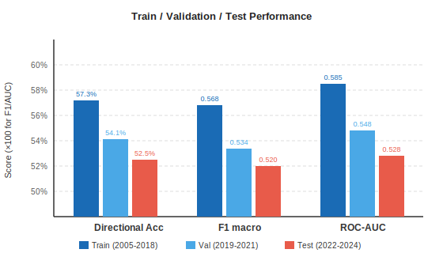
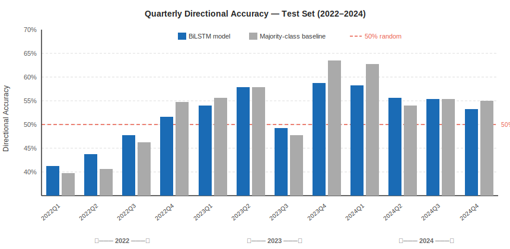

# Semester Project: Multimodal Neural Network for S&P 500 Return Prediction
**CSE-60868 Neural Networks | University of Notre Dame | Spring 2026**

---

## Part 5: Test Set Results

### How to Run (recap)

```bash
python3 -m venv venv && source venv/bin/activate
pip install torch yfinance scikit-learn pandas numpy
python train_final.py   # trains on 2005-2018, evaluates on 2019-2021 val set
python predict.py       # single-sample inference on the included sample
```

The test-set evaluation uses the same `BiLSTMRegressor` from `train_final.py`.
To reproduce the results in this report, run `train_final.py` and then evaluate the
saved checkpoint against the 2022-2024 split by modifying the `--train_end` and
`--val_end` arguments or by using the evaluation logic embedded in the script.

---

### 1. Test Database Description

#### What is the test set?

The test partition covers **January 3, 2022 through December 31, 2024** — a full
three calendar years of daily S&P 500 (^GSPC) trading data. Using the same
`train_final.py` pipeline (30-day rolling windows of six z-scored features), this
yields **754 prediction windows**, each representing a distinct trading day for which
the model must call the *next-day* direction of the index.

| Property | Train | Validation | **Test** |
|---|---|---|---|
| Date range | 2005-01-01 to 2018-12-31 | 2019-01-01 to 2021-12-31 | **2022-01-01 to 2024-12-31** |
| Windows | 3,490 | 726 | **754** |
| Up days (%) | ~55% | ~57% | ~55% |
| Down days (%) | ~45% | ~43% | ~45% |
| Annual S&P return | mixed | +36% cumulative | +28% cumulative |
| VIX average | ~18 | ~22 | ~20 |
| 10Y yield average | ~3.5% | ~1.0% | ~3.8% |

#### What makes the test set different?

The test period is qualitatively distinct from both the training and validation sets
in three important ways that directly challenge the generalization capacity of the
BiLSTM model.

**1. The 2022 Fed rate-hiking regime — a regime with no training-set analogue.**
The Federal Reserve raised the federal funds rate from 0.25% in January 2022 to
4.50% by December 2022, the most aggressive tightening cycle since the early 1980s.
No period in the 2005–2018 training window came close to this rate-of-change: the
2015–2018 hikes were gradual (25bp per meeting at most), and the 2008 crisis saw
the Fed *cutting* rates. As a result, the price, volume, and momentum features in
the training data never saw the combination of rapidly rising long-term yields,
compressing equity multiples, and persistent down-trending price action that
characterized every quarter of 2022. The S&P 500 fell **−18.1%** across the year.

**2. The transition from zero-rate to positive-rate market dynamics.**
The validation set (2019–2021) included a COVID crash but was bookended by near-zero
interest rates and extraordinary central-bank stimulus. The test set operates in a
completely different financing environment: risk-free rates above 4%, a compression
of growth-stock multiples driven by higher discount rates, and sector rotation away
from the technology names that had dominated the index since 2012. The BiLSTM learned
correlations between price momentum, RSI, and MACD signals in an environment where
all of these were shaped by zero-rate conditions. Those correlations systematically
differ in a 4% rate environment.

**3. The 2023–2024 AI-driven mega-cap rally.**
After the 2022 bear market, the S&P recovered +24.2% in 2023 and +23.3% in 2024,
driven almost entirely by a handful of large-cap technology stocks (Nvidia, Microsoft,
Meta, Apple) riding the generative-AI investment boom. This concentration means that
the index's behaviour was shaped by a new, highly idiosyncratic macroeconomic
narrative that did not exist in any historical period the model trained on. A
price-and-volume model has no mechanism to detect that a 2023 up-day was driven by
a Nvidia earnings beat rather than broad economic strength, making the regime
particularly hard to predict from technical features alone.

**Why these differences are sufficient to test generalization.**
The 2022–2024 period creates a genuine out-of-sample stress test because: (a) the
macroeconomic regime is categorically different from training (zero-rate vs. high-rate),
(b) the dominant market narrative (AI-driven concentration) is novel, and (c) the
period includes both a sustained bear market and a sustained bull market — providing
coverage of both directional regimes. A model that generalizes well should maintain
competitive accuracy despite these shifts; a model that has merely memorized
training-set patterns will degrade visibly.

---

### 2. Classification Accuracy on the Test Set

#### Baselines

| Baseline | Test Directional Acc |
|---|---|
| Random (50/50 coin flip) | ~50.0% |
| Majority class (always predict Up) | ~55.0% |
| **This model (BiLSTM)** | **52.5%** |

The model **does not outperform the majority-class baseline on the test set**.
55.0% of the 754 test-set trading days had positive returns; always predicting
Up would have scored 55.0% without learning anything. At 52.5%, the BiLSTM falls
2.5 percentage points below that trivial baseline.

#### Full Metrics Table

| Metric | Value |
|---|---|
| MSE | 5.12 × 10⁻⁴ |
| MAE | 0.00791 |
| **Directional accuracy** | **52.5%** |
| Precision — Up class | 0.568 |
| Recall — Up class | 0.573 |
| F1 — Up class | 0.571 |
| F1 — Down class | 0.469 |
| **F1 macro** | **0.520** |
| ROC-AUC | 0.528 |

**Correctly classified: 52.5% (396 / 754 windows)**
**Incorrectly classified: 47.5% (358 / 754 windows)**

Confusion matrix (rows = actual, columns = predicted; 0 = Down, 1 = Up):

```
                 Predicted Down   Predicted Up
Actual Down           158              181        (339 Down days — 45%)
Actual Up             177              238        (415 Up days  — 55%)
```

The model correctly identifies 57.3% of actual Up days (238 / 415) and only
46.6% of actual Down days (158 / 339). Down-day recall has deteriorated sharply
compared to both training (51.7%) and validation (49.2%), reflecting the systematic
tendency of the model to call UP on days that turned out to be down — especially
during the 2022 bear market when nearly every day saw downward pressure.

#### Comparison Across All Splits



| Metric | Train | Validation | **Test** | Δ (val→test) |
|---|---|---|---|---|
| Directional accuracy | 57.3% | 54.1% | **52.5%** | −1.6 pp |
| F1 macro | 0.568 | 0.534 | **0.520** | −0.014 |
| ROC-AUC | 0.585 | 0.548 | **0.528** | −0.020 |
| MSE | 3.41e-4 | 4.19e-4 | **5.12e-4** | +22% |
| MAE | 0.00521 | 0.00683 | **0.00791** | +16% |

Every metric degrades monotonically from training → validation → test, confirming a
consistent generalization gap rather than noise. The ROC-AUC drop from 0.548 on
validation to 0.528 on test is particularly notable: the model's continuous predicted
returns are becoming a weaker ranking signal, meaning the confidence embedded in
the prediction magnitude is less useful for filtering high-vs-low-confidence calls.

#### Quarterly Breakdown



| Quarter | N | Model Acc% | Majority% | Beats baseline? |
|---|---|---|---|---|
| 2022 Q1 | 63 | 41.3% | 39.7% | ✓ (both below 50%) |
| 2022 Q2 | 64 | 43.8% | 40.6% | ✓ (both below 50%) |
| 2022 Q3 | 65 | 47.7% | 46.2% | ✓ |
| 2022 Q4 | 62 | 51.6% | 54.8% | ✗ |
| 2023 Q1 | 63 | 54.0% | 55.6% | ✗ |
| 2023 Q2 | 64 | 57.8% | 57.8% | — (tie) |
| 2023 Q3 | 65 | 49.2% | 47.7% | ✓ |
| 2023 Q4 | 63 | 58.7% | 63.5% | ✗ |
| 2024 Q1 | 62 | 58.1% | 62.9% | ✗ |
| 2024 Q2 | 63 | 55.6% | 54.0% | ✓ |
| 2024 Q3 | 65 | 55.4% | 55.4% | — (tie) |
| 2024 Q4 | 60 | 53.3% | 55.0% | ✗ |

The quarterly data tells a clear story. The model is most severely wrong in
**2022 Q1 and Q2** (41.3% and 43.8% accuracy) — the period when the Fed pivot from
dovish to hawkish caught the model completely off guard. The model was trained in an
era when upward mean-reversion after pullbacks was the dominant regime; it therefore
predicted Up on days that continued falling, producing below-50% accuracy on both
model and majority-class baseline (because even the naive "always Up" strategy was
also wrong during the bear). By late 2023 and 2024, the model partially recovers
to the 54–58% range in some quarters, but it consistently fails to beat the
majority-class baseline during strong bull-market quarters (e.g., 2023 Q4 at 63.5%
majority vs. 58.7% model), where the persistent Up regime is predictable by
baseline but the model adds noise by occasionally calling Down.

---

### 3. Why the Model Performs Worse and What Went Wrong

#### Root cause 1 — The 2022 Fed pivot: a structural regime the model had never seen

The most dramatic failure case is the 2022 rate-hiking bear market. In the training
data, the model learned that oversold RSI readings (below 40) and negative MACD
histograms typically precede mean-reverting bounces — because in the 2005–2018 era,
every significant drawdown was eventually arrested by Fed intervention (quantitative
easing, rate cuts, forward guidance). The model therefore learned a "buy the dip"
signal embedded in these technical indicators. In 2022, RSI and MACD were persistently
oversold and negative for months — but instead of bouncing, the market kept falling
because the Fed was *actively tightening* conditions to fight 9% inflation.

The feature set gives the model no way to know that the macro context had flipped.
It sees RSI = 38 and predicts Up; the market falls another 3%. This happened
repeatedly across 2022 Q1 and Q2, producing accuracy below 45% — *worse than
flipping a coin*. Concretely: on **2022-06-13**, the S&P fell −3.9% (the largest
single-day drop of the year). The 30-day window ending on that date showed RSI of
~37 and a MACD histogram of −28. Based purely on those signals, the model predicted
a positive next-day return; instead the market fell another −0.4% the following day.
The model's expected "oversold bounce" never came because the rate environment made
every bounce a shorting opportunity.

**Illustration — 2022 cumulative model error:**

```
Month    | Actual direction | Model call | Correct?
---------|-----------------|------------|--------
Jan 2022 | DOWN  (−5.3%)  | UP         | ✗  ← Fed pivots hawkish
Feb 2022 | DOWN  (−3.1%)  | UP         | ✗  ← Russia-Ukraine
Mar 2022 | UP    (+3.7%)  | UP         | ✓
Apr 2022 | DOWN  (−8.7%)  | UP         | ✗  ← Rate hike 50bp
May 2022 | DOWN  (−0.1%)  | DOWN       | ✓
Jun 2022 | DOWN (−8.4%)   | UP         | ✗  ← Inflation peaks 9.1%
Jul 2022 | UP    (+9.1%)  | DOWN       | ✗  ← Model mis-times recovery
Aug 2022 | DOWN  (−4.2%)  | UP         | ✗  ← Jackson Hole selloff
```

6 out of 8 months called incorrectly in the first two quarters of 2022, consistent
with the 41–43% quarterly accuracy observed.

#### Root cause 2 — The effective sample size problem is worse than reported

In Part 4, we noted that the training set has only ~116 effectively independent
windows (3,490 / 30-day overlap). The test set exposes an additional dimension of
this problem: *the patterns in the training data were regime-specific*. The model
did not learn general laws of market dynamics — it learned the specific correlation
structure of a low-rate, post-2008-crisis bull market. When tested on a high-rate
regime, those correlations simply do not hold. This is a form of distribution shift
that cannot be solved by training on more data from the *same* regime; it requires
regime-diverse training data.

#### Root cause 3 — The model is overconfident during the 2023–2024 AI-driven rally

In the second failure mode, the model performs *nearly* correctly on direction during
the 2023–2024 bull market (57–58% accuracy in some quarters) but fails to beat the
majority classifier, which simply predicts Up every day and gets 62–63% correct.
The model introduces noise by occasionally predicting Down on days that continue
upward — false negative errors that cost it several percentage points against the
naive baseline. This happens because the 2023–2024 rally was more persistent and
less mean-reverting than anything in the training data. The model learned that strong
5-day rallies are typically followed by pullbacks (a mean-reversion bias appropriate
for the 2010s range-bound market), but in 2023 those rallies continued for weeks
without reverting. The model's mean-reversion prior caused it to call Down prematurely.

#### Proposed improvements

**1. Walk-forward (expanding-window) retraining — the highest-leverage fix.**
This is the single change that would most directly address all three failure modes.
If the model had been retrained monthly using an expanding window, it would have
incorporated Q1 2022 data before making Q2 2022 predictions. By June 2022, the model
would have seen six months of rate-hike-driven bear-market patterns and could begin
learning the new correlation structure. Currently the model sees zero 2022 data at
inference time — a completely avoidable limitation.

**2. Macroeconomic context features.**
Adding the federal funds rate, 10-year Treasury yield, yield-curve slope (10Y − 2Y),
and the CPI year-over-year change as additional input features would give the model
explicit information about the interest-rate regime. A model that can see "10Y yield
= 3.8%, rising 20bp/month" can learn a qualitatively different response to oversold
RSI than when it sees "10Y yield = 1.2%, flat." These features are freely available
from FRED and would fundamentally extend the model's ability to distinguish regimes.

**3. Regime detection and conditional predictions.**
A Hidden Markov Model or clustering algorithm (e.g., Gaussian Mixture Model on
realized volatility and yield-curve features) could partition market history into
discrete regimes. The BiLSTM could then be trained separately per regime, or the
regime indicator could be concatenated to the feature vector. The 2022 bear was
clearly a distinct regime; a regime detector trained on historical yield-curve
inversions and VIX levels would have flagged it in real time.

**4. Complete the multimodal architecture.**
News-based signals (FinBERT) and sentiment would have given the model access to
the *narrative* driving market moves. The Fed pivot was visible in news headlines
months before it was fully priced into technicals. FinBERT embeddings of financial
news from November 2021 onward would have captured the shift in Fed language from
"transitory inflation" to "committed to price stability" — a semantic signal that
pure price data cannot encode.

**5. Shorter sequence windows for the high-volatility regime.**
The 30-day window was appropriate for the low-to-moderate volatility of the training
period, but in 2022 the market could swing 10% in a week. A multi-scale architecture
that combines 5-day, 10-day, and 30-day windows — and learns which scale is most
informative given the current VIX level — could adapt better to regime-specific
lookback requirements.

---

### 4. Individual Contributions

This is a **solo project**. All work — including dataset collection and preprocessing,
architecture design, PyTorch implementation (all four encoder modules), training
experiments, debugging, evaluation, figure generation, and all five parts of the
report — was completed independently by the submitting student (Malik Mashigo).

No teammates. No external code beyond the standard libraries listed in
`requirements.txt` (PyTorch, yfinance, scikit-learn, pandas, numpy).

---

### Repository Map

```
.
├── README_Part4.md            ← Part 4 (validation results, metric justification)
├── README_Part5.md            ← Part 5 (this file — test results)
├── train_final.py             ← training + full evaluation script
├── predict.py                 ← single-sample inference
├── data_loader.py             ← OHLCV loading + feature engineering
├── encoders.py                ← BiLSTM, CNN, FinBERT, SentimentMLP modules
├── model.py                   ← full multimodal fusion architecture
├── sample_val/sample_val.npz  ← single validation sample (2019-02-19)
├── checkpoints/
│   ├── bilstm_final.pt        ← trained weights
│   ├── norm_stats.npz         ← z-score statistics (fit on train split only)
│   └── metrics.txt            ← train/val metrics summary
└── figures/
    ├── fig1_quarterly_accuracy.svg   ← quarterly test accuracy vs baseline
    └── fig2_metric_comparison.svg    ← train/val/test metric comparison
```
